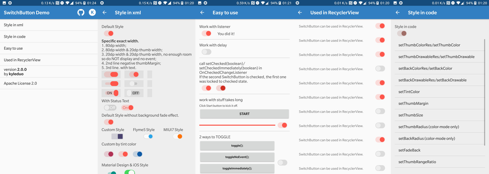

## SwitchButton

开关按钮


### 属性介绍：

*   `swThumbDrawable`: 按钮的drawable
*   `swThumbColor`: 按钮的颜色
*   `swThumbMargin`: 按钮至另一边的间距, 可以是负值，但是注意可能会造成覆盖问题。
*   `swThumbMarginTop`: 同 `swThumbMargin`, 上间距
*   `swThumbMarginBottom`: 同 `swThumbMargin`, 下间距
*   `swThumbMarginLeft`: 同 `swThumbMargin`, 左间距
*   `swThumbMarginRight`: 同 `swThumbMargin`, 右间距
*   `swThumbWidth`: 按钮宽度
*   `swThumbHeight`: 按钮高度
*   `swThumbRadius`: 矩形按钮的圆角半径, 与 `swThumbColor` 一起设置
*   `swBackRadius`: 背景矩形的圆角半径, 与 `swBackColor` 一起设置
*   `swBackDrawable`: 设置背景drawable
*   `swBackColor`: 设置背景色
*   `swFadeBack`: 拖动开关时是否开启逐渐消失的动画效果
*   `swAnimationDuration`: 两个状态之间的动画时间
*   `swTintColor`: 自动渲染SwitchButton样式，不支持SwitchButtonMD或由xml创建的其他样式
*   `swTextOn`: 选中状态文字
*   `swTextOff`: 关闭状态文字
*   `swTextThumbInset`: 按钮下方文字长度
*   `swTextExtra`: 除了实际文本宽度外，背景额外的空间
*   `swTextAdjust`: 自适应移动文字
*   `swThumbRangeRatio`: 按钮移动范围/按钮的宽度，浮点类型

### 使用java配置：
```java
private String[] opts = new String[]{
			"setThumbColorRes/setThumbColor",
			"setThumbDrawableRes/setThumbDrawable",
			"setBackColorRes/setBackColor",
			"setBackDrawableRes/setBackDrawable",
			"setTintColor",
			"setThumbMargin",
			"setThumbSize",
			"setThumbRadius (color-mode only)",
			"setBackRadius (color-mode only)",
			"setFadeBack",
			"setBackMeasureRatio",
			"setAnimationDuration",
			"setDrawDebugRect",
			"setText",
	};
```