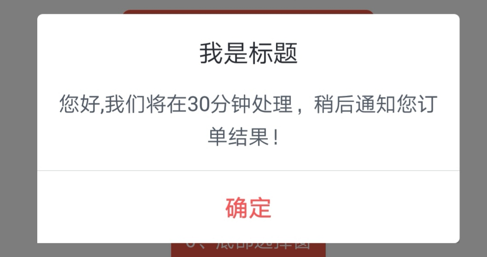
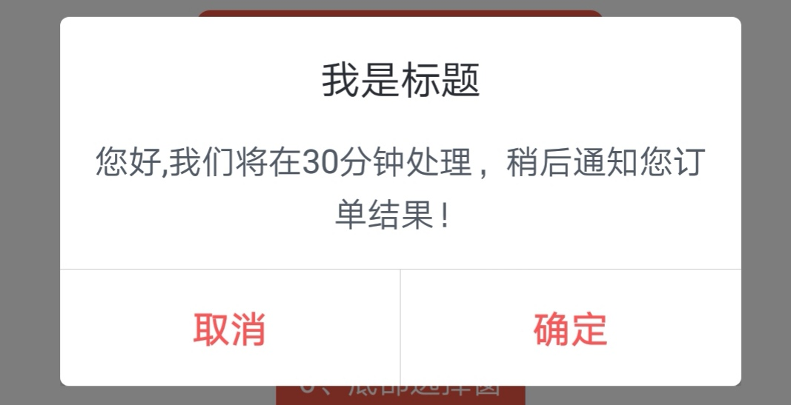

## EasyDialog

封装DialogFragment，快速实现单按钮、2按钮、loading、自定义布局的弹框，可自定义弹出动画，同时支持多个弹框依次弹出

### 使用：
1. **使用内置默认的样式，单个Button：**
```java
  new EasyDialog.Builder(this)
           .setTitle("我是标题")
          .setContent("您好,我们将在30分钟处理，稍后通知您订单结果！")
          .setPositiveButton(new IDialog.OnClickListener() {
               @Override
               public void onClick(IDialog dialog) {
                   dialog.dismiss();
               }
           })
           .show();
```



2. **使用默认样式，2个Button：**
```java
  new EasyDialog.Builder(this)
           .setTitle("我是标题")
          .setContent("您好,我们将在30分钟处理，稍后通知您订单结果！")
          .setPositiveButton(new IDialog.OnClickListener() {
               @Override
               public void onClick(IDialog dialog) {
                   dialog.dismiss();
               }
           })
          .setNegativeButton(new IDialog.OnClickListener() {
               @Override
               public void onClick(IDialog dialog) {
                   dialog.dismiss();
               }
            })
           .show();
```



3. **使用自定义布局的样式：**
```java
  new EasyDialog.Builder(this)
           .setDialogView(R.layout.layout_dialog)//设置dialog布局
           .setAnimStyle(R.style.translate_style)//设置动画 默认没有动画
           .setScreenWidthP(0.85f) //设置屏幕宽度比例 0.0f-1.0f
           .setGravity(Gravity.CENTER)//设置Gravity
           .setWindowBackgroundP(0.2f)//设置背景透明度 0.0f-1.0f 1.0f完全不透明
           .setCancelable(true)//设置是否屏蔽物理返回键 true不屏蔽  false屏蔽
           .setCancelableOutSide(true)//设置dialog外点击是否可以让dialog消失
           .setBuildChildListener(new IDialog.OnBuildListener() {
                    //设置子View
                    @Override
                    public void onBuildChildView(final IDialog dialog, View view, int layoutRes) {
                        //dialog: IDialog
                        //view： DialogView
                        //layoutRes :Dialog的资源文件 如果一个Activity里有多个dialog 可以通过layoutRes来区分
                        final EditText editText = view.findViewById(R.id.et_content);
                        Button btn_ok = view.findViewById(R.id.btn_ok);
                        btn_ok.setOnClickListener(new View.OnClickListener() {
                            @Override
                            public void onClick(View v) {
                                String editTextStr = null;
                                if (!TextUtils.isEmpty(editText.getText())) {
                                    editTextStr = editText.getText().toString();
                                }
                                dialog.dismiss();
                                Toast.makeText(MyApplication.getApplication(), editTextStr, Toast.LENGTH_SHORT).show();
                            }
                        });
                    }
              }).show();
```

4. **按钮设置颜色**
```java
new EasyDialog.Builder(this)
           .setTitle("我是标题")
          .setContent("您好,我们将在30分钟处理，稍后通知您订单结果！")
          .setPositiveButton("确定", R.color.grey, new IDialog.OnClickListener() {
               @Override
               public void onClick(IDialog dialog) {
                   dialog.dismiss();
               }
           })
          .setNegativeButton("取消", R.color.grey, new IDialog.OnClickListener() {
               @Override
               public void onClick(IDialog dialog) {
                   dialog.dismiss();
               }
            })
           .show();
```


5. **底部pop示例：**
```java
    new EasyDialog.Builder(this)
            .setDialogView(R.layout.layout_share)
            .setWindowBackgroundP(0.5f)
            .setScreenWidthP(1.0f)
            .setGravity(Gravity.BOTTOM)
            .setCancelable(false)
            .setCancelableOutSide(false)
            .setAnimStyle(R.style.AnimUp)
            .setBuildChildListener { dialog, view, layoutRes ->
                val recyclerView: RecyclerView = view.findViewById(R.id.recycler_view)
                recyclerView.layoutManager = LinearLayoutManager(this@CommonDialogActivity,
                    LinearLayoutManager.HORIZONTAL, false)
                recyclerView.adapter = ShareAdapter()
                val btn_cancel_dialog = view.findViewById<Button>(R.id.btn_cancel_dialog)
                btn_cancel_dialog.setOnClickListener {
                    Toast.makeText(MyApplication.getApplication(), "取消", Toast.LENGTH_SHORT).show()
                    dialog.dismiss()
                }
            }.show();
```


5. **统一管理多个Dialog依次弹出：**
```java
EasyDialog.Builder builder1 = new EasyDialog.Builder(this);
EasyDialog.Builder builder2 = new EasyDialog.Builder(this)
//添加第一个Dialog
EasyDialogsManager.getInstance().requestShow(new DialogWrapper(builder1));
//添加第二个Dialog
EasyDialogsManager.getInstance().requestShow(new DialogWrapper(builder2));
```