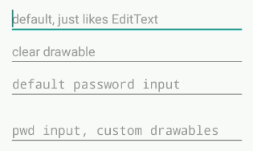
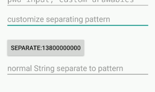
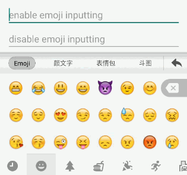

## EasyEditText

集成常用功能，如：一键清空、密码显示、禁止输入表情、号码分割等







### 直接使用：

```xml
  <com.easyandroid.widgets.edittext.EasyEditText
      android:layout_width="match_parent"
      android:layout_height="wrap_content"
      android:hint="default, just like EditText"
      app:e_disableClear="true"/>

  <com.easyandroid.widgets.edittext.EasyEditText
      android:layout_width="match_parent"
      android:layout_height="wrap_content"
      android:hint="clear drawable"/>

  <com.easyandroid.widgets.edittext.EasyEditText
      android:layout_width="match_parent"
      android:layout_height="wrap_content"
      android:hint="default password input"
      android:inputType="textPassword"/>

  <com.easyandroid.widgets.edittext.EasyEditText
      android:layout_width="match_parent"
      android:layout_height="wrap_content"
      android:hint="password input, custom drawables"
      android:inputType="textPassword" <!-- don't set gravity to center, center_horizontal, right or end, otherwise the ClearDrawable will not appear. -->
      app:e_clearDrawable="@mipmap/ic_clear" <!--support vector drawable-->
      app:e_hidePwdDrawable="@mipmap/ic_hide" <!--support vector drawable-->
      app:e_showPwdDrawable="@mipmap/ic_show"/> <!--support vector drawable-->

  <com.easyandroid.widgets.edittext.EasyEditText
      android:layout_width="match_parent"
      android:layout_height="wrap_content"
      android:hint="the pattern to separate the content"
      app:e_pattern="3,4,4"
      app:e_separator=" "/>

  <com.easyandroid.widgets.edittext.EasyEditText
      android:layout_width="match_parent"
      android:layout_height="wrap_content"
      android:hint="custom interaction padding"
      android:inputType="textPassword"
      app:e_interactionPadding="16dp"/>
```