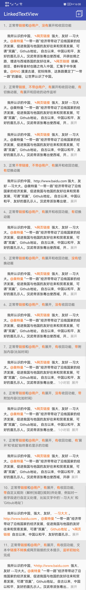

## LinkedTextView

一个支持点击文字、展开文字、收起文字、点击跳转网页的TextView
点击文字颜色、展开/收起两个字的颜色设置都支持




-----
### 使用示例：

1. **正常带链接和@用户，没有展开和收回功能：**
```xml
<com.easyandroid.widgets.textview.link.LinkedTextView
    android:id="@+id/ltv_01"
    android:layout_width="match_parent"
    android:layout_height="wrap_content"
    android:layout_margin="15dp"
    android:lineSpacingExtra="4dp"
    android:textSize="14sp" />
```


2. **正常带链接，不带@用户，有展开和收回功能，有切换动画，有展开和回收的动作监听：**
```xml
<com.easyandroid.widgets.textview.link.LinkedTextView
    android:id="@+id/ltv_02"
    android:layout_width="match_parent"
    android:layout_height="wrap_content"
    android:layout_margin="15dp"
    android:lineSpacingExtra="4dp"
    android:textSize="14sp"
    app:ltv_max_line="5"
    app:ltv_need_contract="true"
    app:ltv_need_expand="true"
    app:ltv_need_mention="false" />
```
```xml
<com.easyandroid.widgets.textview.link.LinkedTextView
    android:id="@+id/ltv_02_1"
    android:layout_width="match_parent"
    android:layout_height="wrap_content"
    android:layout_margin="15dp"
    android:lineSpacingExtra="4dp"
    android:textSize="14sp"
    app:ltv_max_line="5"
    app:ltv_need_contract="true"
    app:ltv_need_expand="true"
    app:ltv_need_mention="false" />
```


3. **正常不带链接，不带@用户，有展开和收回功能，有切换动画：**
```xml
<com.easyandroid.widgets.textview.link.LinkedTextView
    android:id="@+id/ltv_03"
    android:layout_width="match_parent"
    android:layout_height="wrap_content"
    android:layout_margin="15dp"
    android:lineSpacingExtra="4dp"
    android:textSize="14sp"
    app:ltv_max_line="5"
    app:ltv_need_contract="true"
    app:ltv_need_expand="true"
    app:ltv_need_link="false"
    app:ltv_need_mention="false" />
```


4. **正常带链接和@用户，有展开和收回功能，有切换动画：**
```xml
<com.easyandroid.widgets.textview.link.LinkedTextView
    android:id="@+id/ltv_04"
    android:layout_width="match_parent"
    android:layout_height="wrap_content"
    android:layout_margin="15dp"
    android:lineSpacingExtra="4dp"
    android:textSize="14sp"
    app:ltv_max_line="5"
    app:ltv_need_contract="true"
    app:ltv_need_expand="true" />
```


5. **正常带链接和@用户，有展开和收回功能，没有切换动画：**
```xml
<com.easyandroid.widgets.textview.link.LinkedTextView
    android:id="@+id/ltv_05"
    android:layout_width="match_parent"
    android:layout_height="wrap_content"
    android:layout_margin="15dp"
    android:lineSpacingExtra="4dp"
    android:textSize="14sp"
    app:ltv_max_line="5"
    app:ltv_need_contract="true"
    app:ltv_need_expand="true" />
```


6. **正常带链接和@用户，有展开，没有收回功能：**
```xml
<com.easyandroid.widgets.textview.link.LinkedTextView
    android:id="@+id/ltv_06"
    android:layout_width="match_parent"
    android:layout_height="wrap_content"
    android:layout_margin="15dp"
    android:lineSpacingExtra="5dp"
    android:textSize="14sp"
    app:ltv_max_line="5"
    app:ltv_need_contract="false"
    app:ltv_need_expand="true" />
```


7. **正常带链接和@用户，有展开，有收回功能，带附加内容(比如时间)：**
```xml
<com.easyandroid.widgets.textview.link.LinkedTextView
    android:id="@+id/ltv_07"
    android:layout_width="match_parent"
    android:layout_height="wrap_content"
    android:layout_margin="15dp"
    android:lineSpacingExtra="4dp"
    android:textSize="14sp"
    app:ltv_max_line="5"
    app:ltv_need_contract="true"
    app:ltv_need_expand="true" />
```


8. **正常带链接和@用户，有展开，没有收回功能，带附加内容(比如时间)：**
```xml
<com.easyandroid.widgets.textview.link.LinkedTextView
    android:id="@+id/ltv_08"
    android:layout_width="match_parent"
    android:layout_height="wrap_content"
    android:layout_margin="15dp"
    android:lineSpacingExtra="5dp"
    android:textSize="14sp"
    app:ltv_max_line="5"
    app:ltv_need_contract="false"
    app:ltv_need_expand="true" />
```


9. **正常带链接和@用户，有展开，有收回功能，有'展开'和'收起'始终靠右显示的功能：**
```xml
<com.easyandroid.widgets.textview.link.LinkedTextView
    android:id="@+id/ltv_09"
    android:layout_width="match_parent"
    android:layout_height="wrap_content"
    android:layout_margin="15dp"
    android:lineSpacingExtra="5dp"
    android:textSize="14sp"
    app:ltv_max_line="5"
    app:ltv_need_contract="true"
    app:ltv_need_expand="true"
    app:ltv_need_self="true" />
```


10. **正常带链接和@用户，有展开，有收回功能，带自定义规则（解析`标题`(规则)并处理，例如对一些字段进行自定义处理，比如文字中的'--习大大' 和 'Github地址'）：**
```xml
<com.easyandroid.widgets.textview.link.LinkedTextView
    android:id="@+id/ltv_10"
    android:layout_width="match_parent"
    android:layout_height="wrap_content"
    android:layout_margin="15dp"
    android:lineSpacingExtra="5dp"
    android:textSize="14sp"
    app:ltv_max_line="5"
    app:ltv_need_contract="true"
    app:ltv_need_expand="true"
    app:ltv_need_self="true" />
```


11. **正常带链接和@用户，有展开，有收回功能，文本中链接不转换成网页链接的文本提示，监听初始化完成：**
```xml
<com.easyandroid.widgets.textview.link.LinkedTextView
    android:id="@+id/ltv_11"
    android:layout_width="match_parent"
    android:layout_height="wrap_content" 
    android:layout_margin="15dp"
    android:lineSpacingExtra="5dp"
    android:textSize="14sp"
    app:ltv_max_line="5"
    app:ltv_need_contract="true"
    app:ltv_need_convert_url="false"
    app:ltv_need_expand="true" />
```


### 属性说明：
```xml
<!--保留的行数-->
<attr name="ltv_max_line" format="integer" />

<!--是否需要展开-->
<attr name="ltv_need_expand" format="boolean" />

<!--是否需要收起 这个是建立在开启展开的基础上的-->
<attr name="ltv_need_contract" format="boolean" />

<!--是否需要@用户 -->
<attr name="ltv_need_mention" format="boolean" />

<!--是否需要对链接进行处理 -->
<attr name="ltv_need_link" format="boolean" />

<!--是否需要动画-->
<attr name="ltv_need_animation" format="boolean" />

<!--是否需要将连接转换成网页链接显示 默认为true-->
<attr name="ltv_need_convert_url" format="boolean" />

<!--是否需要自定义规则-->
<attr name="ltv_need_self" format="boolean" />

<!--收起的文案-->
<attr name="ltv_contract_text" format="string" />

<!--展开的文案-->
<attr name="ltv_expand_text" format="string" />

<!--展开的文字的颜色-->
<attr name="ltv_expand_color" format="color" />

<!--收起的文字的颜色-->
<attr name="ltv_contract_color" format="color" />

<!--链接的文字的颜色-->
<attr name="ltv_link_color" format="color" />

<!--@用户的文字的颜色-->
<attr name="ltv_mention_color" format="color" />

<!--自定义规则的文字的颜色-->
<attr name="ltv_self_color" format="color" />

<!--链接的图标-->
<attr name="ltv_link_res" format="reference"/>

<!--是否需要永远将展开或者收回放置在最后边-->
<attr name="ltv_need_always_showright" format="boolean" />
```


### Java
```java
/**
        *   正常的使用
        */
        LinkedTextView linkedTextView = findViewById(R.id.ltv_01);
        //需要显示的内容
        String yourText = "  我所认识的中国，强大、友好。@奥特曼 “一带一路”经济带带动了沿线国家的经济发展，促进我国与他国的友好往来和贸易发展，可谓“双赢”。http://www.baidu.com 自古以来，中国以和平、友好的面孔示人。汉武帝派张骞出使西域，开辟丝绸之路，增进与西域各国的友好往来。http://www.baidu.com 胡麻、胡豆、香料等食材也随之传入中国，汇集于中华美食。@RNG 漠漠古道，驼铃阵阵，这条路奠定了“一带一路”的基础，让世界认识了中国。";
        //将内容设置给控件
        linkedTextView.setContent(yourText);
        //xml中的属性也可以通过代码设置 比如
        linkedTextView.setmNeedExpend(true);
        //还有很多。。。。
        //添加点击监听
        linkedTextView.setLinkClickListener(new LinkedTextView.OnLinkClickListener() {
            @Override
            public void onLinkClickListener(LinkType linkType, String content,String selfContent) {
                //根据类型去判断
                if (type.equals(LinkType.LINK_TYPE)) {
                    Toast.makeText(MainActivity.this, "你点击了链接 内容是：" + content, Toast.LENGTH_SHORT).show();
                } else if (type.equals(LinkType.MENTION_TYPE)) {
                    Toast.makeText(MainActivity.this, "你点击了@用户 内容是：" + content, Toast.LENGTH_SHORT).show();
                } else if (type.equals(LinkType.SELF)) {
                    Toast.makeText(MainActivity.this, "你点击了自定义规则 内容是：" + content + " " + selfContent, Toast.LENGTH_SHORT).show();
                }
            }
        });
        //添加展开和收回操作
        linkedTextView.setExpandOrContractClickListener(type -> {
            if (type.equals(StatusType.STATUS_CONTRACT)) {
                Toast.makeText(MainActivity.this, "收回操作", Toast.LENGTH_SHORT).show();
            } else {
                Toast.makeText(MainActivity.this, "展开操作", Toast.LENGTH_SHORT).show();
            }
        });
				//监听是否初始化完成 在这里可以获取是否支持展开/收回
        linkedTextView.setOnGetLineCountListener(new ExpandableTextView.OnGetLineCountListener() {
            @Override
            public void onGetLineCount(int lineCount, boolean canExpand) {
                Toast.makeText(MainActivity.this, "行数：" + lineCount + "  是否满足展开条件：" + canExpand, Toast.LENGTH_SHORT).show();
            }
        });
				//添加展开和收回操作 只触发点击 不真正触发展开和收回操作
        linkedTextView.setExpandOrContractClickListener(type -> {
            if (type.equals(StatusType.STATUS_CONTRACT)) {
                Toast.makeText(MainActivity.this, "收回操作，不真正触发收回操作", Toast.LENGTH_SHORT).show();
            } else {
                Toast.makeText(MainActivity.this, "展开操作，不真正触发展开操作", Toast.LENGTH_SHORT).show();
            }
        },false);
```